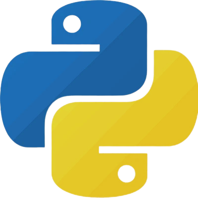

# 💫 About Me:

<!---->

Hello, I'm Sulaf!✨  
:computer: A very motivated computer science student with a curious mind  
:bar_chart: Currently diving into Data Analytics through 
<a href="https://mcit.gov.eg/en/Human_Capacity/MCIT/Digital_Egypt_Pioneers_Initiative">
DEPI (Round 4)
</a>!  
:octocat: Actively building my Python skills!

## 🌐 Socials:
 

# 💻 Tech Stack:

# 📊 GitHub Stats:
 
 
 

<!--
       
-->

<!--

  
  
  
  
  
  
  
  
  
  
  

-->
  

---

